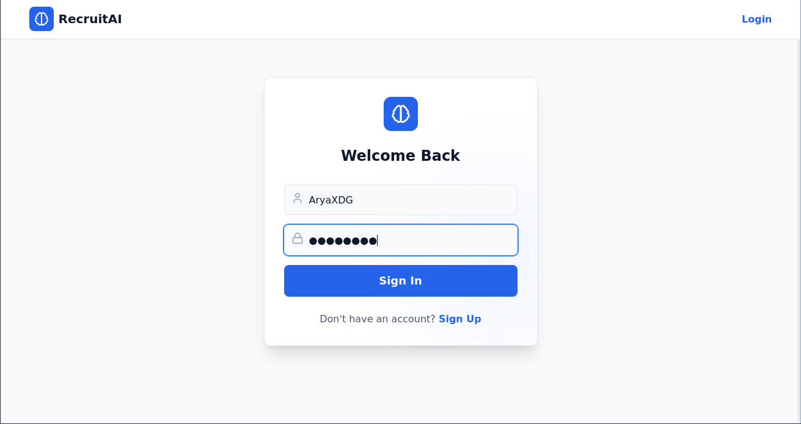
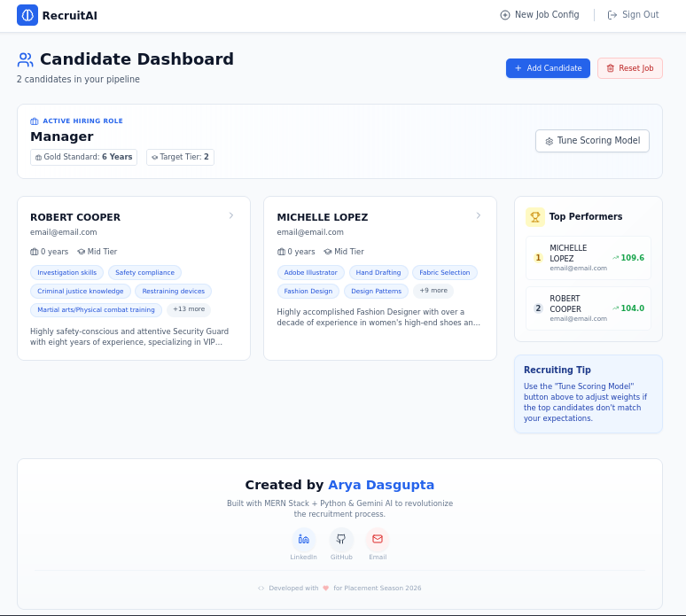
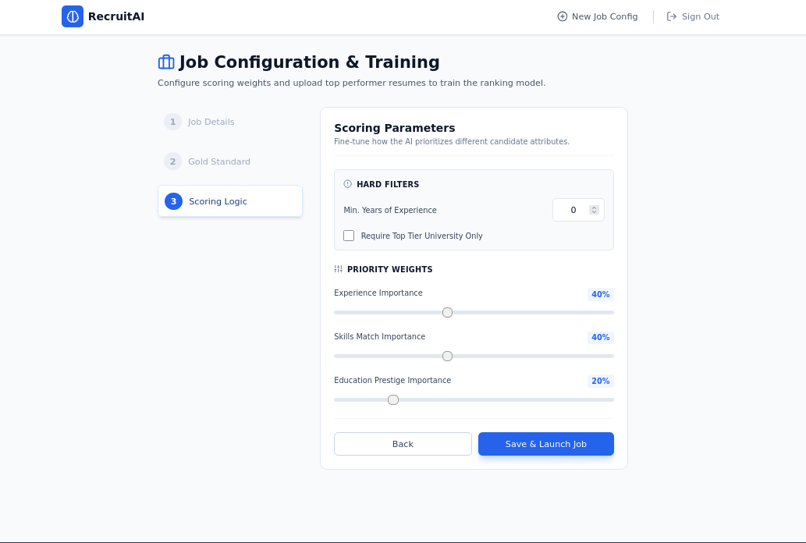
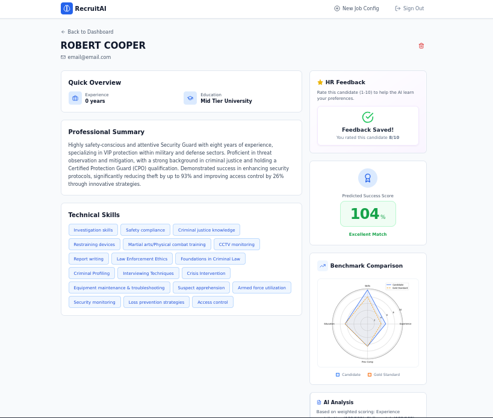
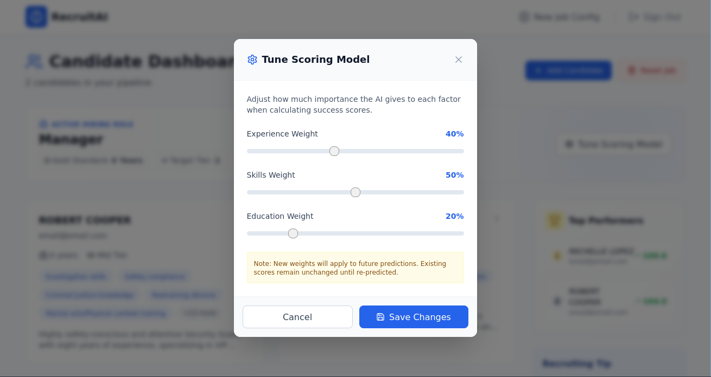

# RecruitAI - Intelligent Recruitment System


**RecruitAI** is a next-generation Applicant Tracking System (ATS) designed to streamline the hiring process. By combining the **MERN Stack** with a dedicated **Python Machine Learning microservice** and **Google Gemini**, it automatically parses resumes, scores candidates based on job descriptions, and provides visual analytics to help HR make data-driven decisions.

## Key Features

* **Smart Resume Parsing:** Automatically extracts text and skills from PDF resumes using OCR and NLP.
* **Hybrid AI Scoring:**
    * **ML Model:** Uses a custom Python-trained model (`recruit_model.pkl`) to score candidates based on historical dataset averages.
    * **GenAI Integration:** Utilizes Google Gemini API for semantic understanding and qualitative "culture fit" analysis.
* **Interactive Dashboard:** Visual analytics using Recharts to display candidate leaderboards and skill gap analysis.
* **Job Role Configuration:** Dynamic job setup allows recruiters to define specific weighting for skills and experience.
* **Secure Authentication:** JWT-based authentication with encrypted user data.

## Application Screenshots

### 1. Secure Authentication
Secure login portal for HR administrators.


### 2. Dashboard Overview
A comprehensive view of active job postings and recent applicants.


### 3. Job Configuration
Dynamic setup to define required skills and weightage for specific roles.


### 4. Candidate Analysis & Leaderboard
Detailed breakdown of candidate scores, resume parsing results, and AI-generated insights.


### 5. Model Tuning & Analytics
Visualization of the underlying ML scoring metrics and dataset averages.


---

## Tech Stack

### Frontend (Client)
* **Framework:** React (Vite)
* **Styling:** Tailwind CSS
* **State Management:** React Context API
* **Visualizations:** Recharts
* **HTTP Client:** Axios

### Backend (Server)
* **Runtime:** Node.js & Express.js
* **Database:** MongoDB (Mongoose)
* **Authentication:** JWT (JSON Web Tokens)
* **Resume Parsing:** PDF-parse / Multer

### Machine Learning Service
* **Language:** Python 3.13
* **Framework:** Flask (Microservice)
* **Models:** Scikit-learn (Pickle), Google Gemini API
* **Data Processing:** NumPy, Pandas

## Project Structure

```text
.
├── client/          # React Frontend application
├── server/          # Node.js/Express Backend API
├── ml_service/      # Python Machine Learning Microservice
├── demo_resume/     # Sample resumes for testing
└── screenshots/     # Application preview images
```

## Getting Started

Follow these instructions to set up the project locally.

### Prerequisites

* Node.js (v18+)
* Python (v3.10+)
* MongoDB (Local or Atlas URL)

### 1. Backend Setup (Node.js)

```bash
cd server
npm install
# Create a .env file based on the example below
npm start
```

### 2. Frontend Setup (React)

```bash
cd client
npm install
npm run dev
```

### 3. ML Service Setup (Python)

```bash
cd ml_service
python -m venv venv

# Windows
.\venv\Scripts\activate

# Mac/Linux
source venv/bin/activate

pip install -r requirements.txt
python app.py
```

## Environment Variables

Create a `.env` file in the `server` directory:

```env
PORT=5000
MONGO_URI=your_mongodb_connection_string
JWT_SECRET=your_jwt_secret
GEMINI_API_KEY=your_google_gemini_key
ML_SERVICE_URL=http://localhost:8000
```

## How It Works

1. **Job Setup:** The recruiter creates a job profile (e.g., "Senior React Dev") and defines required skills.

2. **Upload:** Resumes (PDF) are uploaded via the frontend.

3. **Processing:**
   * The Node Backend saves the file and extracts raw text.
   * Text is sent to the Python Microservice.
   * The ML Model vectorizes the resume text and calculates a similarity score against the job description.
   * Google Gemini provides a secondary qualitative summary.

4. **Results:** The frontend displays a ranked leaderboard of candidates with detailed score breakdowns.

## Contributing

Contributions are welcome! Please fork the repository and submit a pull request.

## License

This project is licensed under the MIT License.
