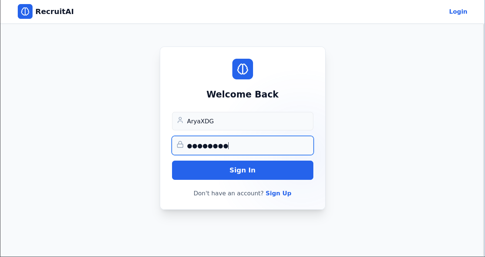
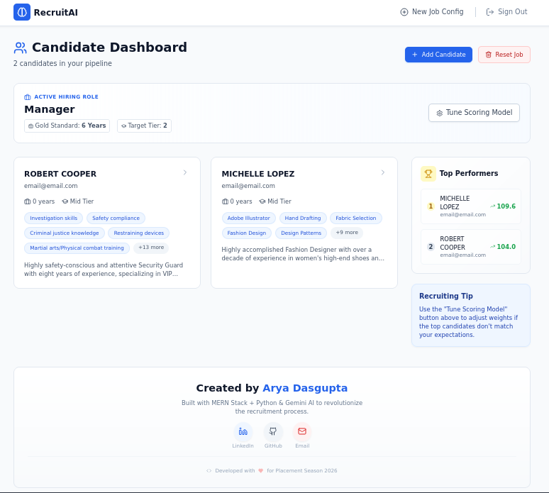
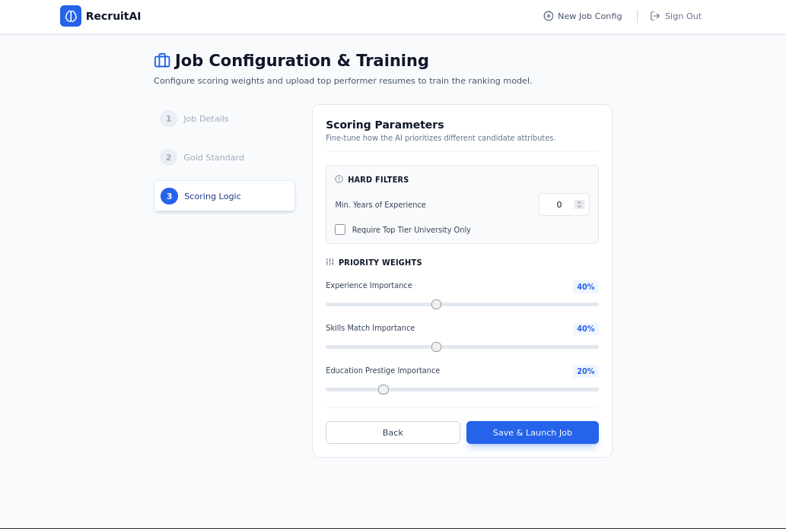
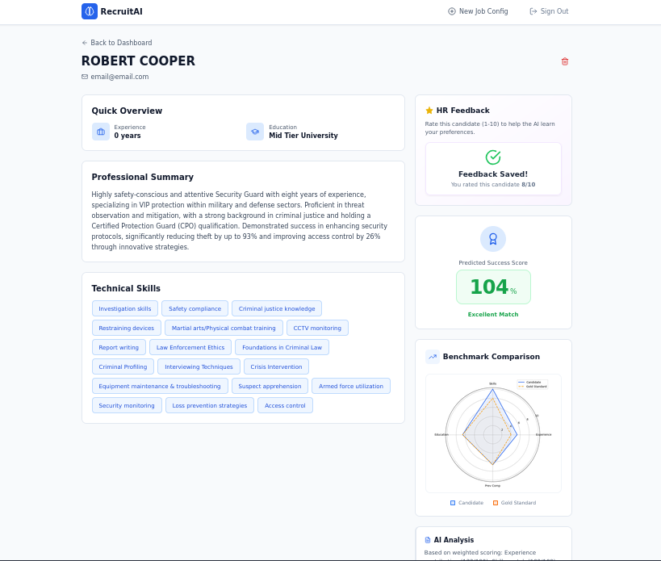
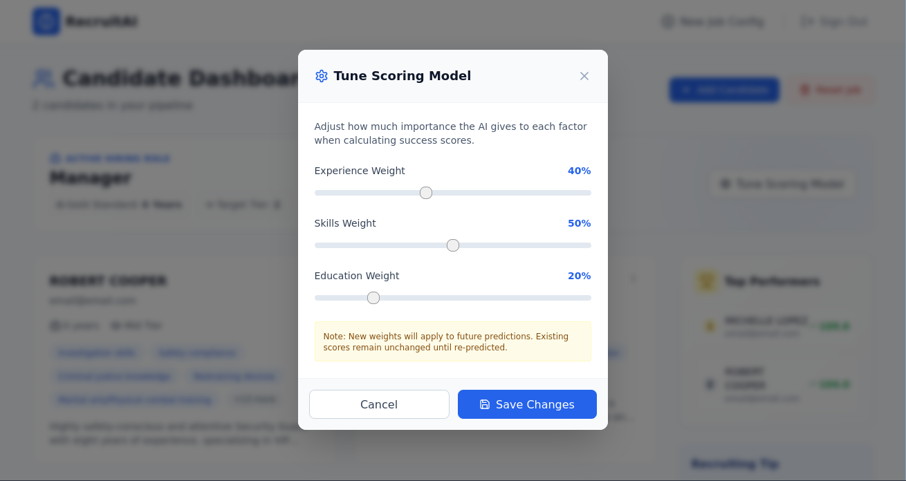

# TalentLens AI

TalentLens AI is a self-hosted Applicant Tracking System (ATS) that scores and ranks resumes against a job profile instead of just keyword-matching them. It's a MERN app (MongoDB, Express, React, Node) that uses Google Gemini for resume parsing and skill embeddings, and a scoring engine that runs entirely on the Node server - no separate ML microservice.

The goal was to build something closer to how a hiring team actually thinks about a resume: which skills matter most for this specific role, whether a candidate's experience backs up their claimed skills, and how confident the system is when it says "this person is a good match."

## Screenshots

**Login**



**Dashboard** - candidates for the active job, sorted by score, with pipeline stage controls (New, Screening, Interview, Offer, Rejected)



**Job configuration** - set minimum experience, target degree/field, and per-skill importance (Must-have / Important / Nice-to-have), or generate all of this automatically from a set of "gold standard" resumes



**Candidate detail** - score breakdown, radar chart against the benchmark, and an evidence table showing the exact line from the resume that backs up each matched skill



**Weight tuning** - how HR ratings feed back into the skill weights over time



## What it actually does

**Resume parsing.** PDFs are uploaded and text is pulled out with `pdf-parse`. If a resume comes back with almost no extractable text (a scanned resume, for example), the app falls back to sending the raw PDF bytes to Gemini directly instead. Gemini returns a fixed JSON structure: name, email, normalized skill tags (categorized as Language / Framework / Tool / Practice / Soft-Skill), years of experience, degree, field of study, a short summary, and a quote from the resume for each skill it detected, so a claimed skill isn't taken at face value.

**Gold-standard benchmarking.** Instead of manually guessing at ideal weights, you can upload up to 12 resumes of people who already succeeded in the role. The server parses all of them, averages their years of experience, finds the most common degree and field, and tallies which skills show up across the group. Any skill appearing in at least a quarter of the resumes gets added to the job's skill list automatically, with its importance tier set by how common it was (75%+ of resumes = Must-have).

**Semantic skill matching.** Skills aren't matched by exact string comparison. Both the job's required skills and each candidate's skills get embedded with Gemini's `gemini-embedding-2`, and matches are decided by cosine similarity with a 0.82 threshold. That means a job requiring "kubernetes" will still credit a resume that only says "k8s" or "container orchestration," rather than missing it on a technicality.

**Weighted scoring.** Each candidate gets three component scores - Experience, Skills, Education - combined using whatever weights the job config has set (40/40/20 by default, adjustable per job). Missing a Must-have skill disqualifies the candidate outright regardless of overall score. Every match or miss is logged individually with the score effect it had, so the final number is never a black box.

**Radar chart.** The server renders a small SVG radar chart per candidate (returned as a base64 data URI, no client-side charting library needed) comparing the candidate's Experience/Skills/Education/Field profile against the benchmark.

**Self-tuning weights.** When an HR reviewer rates a candidate from 1-10, the system nudges the weight of every skill that candidate had, using a simple online update with a decaying learning rate (so weights stabilize as more ratings come in for that skill). Must-have skills are floored at a weight of 80 so they can't be tuned away entirely. Every change is pushed onto a version history array first, so a job config can be rolled back one step if a tuning pass makes things worse.

**Multi-reviewer ratings.** More than one HR user can rate the same candidate; the stored `hr_rating` is the average across all of them, so one reviewer's opinion can't dominate.

**Duplicate detection.** New uploads are checked against existing candidates (per job owner) by email or case-insensitive name match, and flagged rather than silently rejected.

**Keyword-stuffing detection.** Gemini flags resumes that are mostly a long unstructured list of skills with no supporting context, which shows up as an authenticity flag on the candidate.

**Bring-your-own API key.** Each user supplies their own Gemini API key on first login rather than the app using a single shared key. It's encrypted with AES-256-CTR before being stored and only decrypted server-side when a request needs it.

**Pipeline tracking.** Candidates move through New, Screening, Interview, Offer, and Rejected stages directly from the dashboard.

**Proctored assessments with anti-cheat enforcement.** Candidate tests (both the recruiter-assigned assessments and the resume skills verification test) run inside a fullscreen, opaque lockdown dialog: the background dashboard vanishes and only the test is visible. The webcam and microphone turn on via `getUserMedia` before the first question is shown, and the candidate sees a live camera preview with a mic-level meter. Integrity checks run continuously — stream loss or device revocation, covered-camera detection via frame brightness, **face tracking** (skin-tone presence with hysteresis, centroid position, and per-sample travel: absent from frame, stuck at the frame edge, or repeatedly turning away each raise strikes; a frozen frame while a face is present flags a photo spoof), multi-face detection where the browser exposes `FaceDetector`, tab/window focus, and clipboard guards (copy/paste/cut/right-click are blocked, Ctrl+C/V/X too). A caught cheating signal terminates the test immediately on the first offense: the server records a locked, failed attempt (score 0) with the full violation report (terminated flag, reason, restart count) and the candidate cannot retake it — the recruiter sees a black TERMINATED chip on the application with a **Re-arrange test** action that clears the terminated attempt so the candidate can retake it at the recruiter's discretion. The final submit also carries a proctoring report; the server sanitizes it (event-type whitelist, capped event count, bounded notes) before storing it on the result. Recruiters see a per-application proctoring chip (score + flag count, or a black TERMINATED chip with the restart count) so a suspicious session is visible at a glance. Proctoring is integrity support, not a verdict — reviewers stay responsible for decisions.

**Application progress stepper.** Each application on the candidate dashboard shows a Submitted → Reviewed → Shortlisted → Interview → Offer stepper on the right side of the card, with the rejected state breaking the track so candidates can read the recruiter pipeline at a glance.

**Job-field shortlisting.** Job configs carry a coarse job field (Engineering, Sales, Marketing, Design, Finance, Operations, Data & Analytics, HR, Other), set at job creation or via the scoring-model modal. Recruiters can filter the applications list by field to shortlist candidates from the roles they care about.

**Role-specific AI assistants.** Candidate and recruiter dashboards include Talent Coach and Hiring Copilot chat panels. Replies use the signed-in user's saved Gemini key (or the server fallback key). Conversation history is held in the browser session; each request sends only the recent turns and a compact profile/job summary. Raw resume text, email addresses, and phone numbers are not sent as assistant context. The assistants provide suggestions and evidence summaries; they do not make hiring decisions.

**Leaderboard and reset.** A "Top Performers" panel shows the 10 highest-scoring candidates. A one-click reset wipes all candidates and job configs for the current user to start a role from scratch.

## Tech stack

**Client:** React 18 (Vite), React Router, Tailwind CSS, Axios, lucide-react

**Server:** Node.js, Express 5, MongoDB with Mongoose, JWT auth (`jsonwebtoken` + `bcryptjs`), Multer (in-memory storage, no files ever touch disk), `pdf-parse`

**AI:** `@google/generative-ai` - Gemini 3.8 Flash for text generation and `gemini-embedding-2` for skill embeddings

There is no separate Python or Flask service. All scoring logic (cosine similarity, weighted aggregation, the online weight-tuning update, and SVG generation for the radar chart) lives in `server/services/mlService.js` and runs in-process alongside the API.

## Project structure

```
RecruitAI/
├── client/                    React frontend (Vite)
│   ├── src/
│   │   ├── components/        Navbar, CandidateCard, ResumeUploader, Leaderboard, etc.
│   │   ├── context/            AuthContext (login state + BYOK modal trigger)
│   │   ├── pages/               Dashboard, JobSetup, CandidateDetails, Login
│   │   └── services/           Axios instance / API calls
│   └── ...
├── server/                    Express backend
│   ├── config/                 MongoDB connection
│   ├── controllers/            auth, candidate, jobConfig, user
│   ├── middleware/              JWT auth guard
│   ├── models/                  User, Candidate, JobConfig (Mongoose schemas)
│   ├── routes/
│   ├── services/
│   │   ├── geminiService.js    Resume parsing + embeddings via Gemini
│   │   └── mlService.js        Scoring, explainability, radar chart, weight tuning
│   └── utils/                   PDF text extraction, AES-256 encryption for stored API keys
├── demo_resume/                Sample PDFs for testing uploads and benchmarking
└── screenshots/
```

## Getting started

You'll need Node.js 18+, a MongoDB instance (local or Atlas), and a Google Gemini API key (free to generate at [Google AI Studio](https://aistudio.google.com/)).

### Backend

```bash
cd server
npm install
```

Create a `.env` file in `server/`:

```env
PORT=5000
MONGO_URI=your_mongodb_connection_string
JWT_SECRET=any_long_random_string
ENCRYPTION_KEY=must_be_exactly_32_characters
GEMINI_API_KEY=your_gemini_api_key
```

`ENCRYPTION_KEY` has to be exactly 32 characters - it's used directly as an AES-256 key and the server will refuse to start otherwise. `GEMINI_API_KEY` here acts as a fallback; each user can also save their own key from the app after logging in, which is what actually gets used per-request.

```bash
npm start
```

### Frontend

```bash
cd client
npm install
npm run dev
```

The client expects the API to be reachable per the base URL configured in `client/src/services/api.js`.

## How a job actually gets set up

1. Create a job config (`New Job Config` in the nav bar) - either fill in experience/degree/field and add skills manually, or upload a handful of resumes from people who've already done well in the role and let the app derive the benchmark and skill weights for you.
2. Upload candidate resumes. Each one gets parsed, checked for duplicates, and embedded.
3. Run a prediction on a candidate to get its score, disqualification status, and explainability breakdown against the currently active job config.
4. Rate candidates as you review them. Ratings feed back into the skill weights automatically, so the config gets a little more accurate the more you use it - with a version history you can roll back if a change doesn't help.

### Recruitment platform endpoints

The existing candidate, job-config, auth, and assistant APIs remain available. The following authenticated routes extend them; recruiter-owned resources are scoped to the signed-in recruiter, and admin accounts must be provisioned directly by an operator (public registration cannot create admins).

| Method | Route | Access | Purpose |
| --- | --- | --- | --- |
| `GET` | `/api/platform/jobs?role=&location=&skills=` | Candidate | Search published role configurations |
| `PATCH` | `/api/platform/jobs/:id` | Recruiter/Admin | Update role description, compensation, publication, and assessment requirements |
| `GET` | `/api/platform/jobs/:jobId/rankings` | Recruiter/Admin | Ranked applications with weighted components, strengths, gaps, and scorer evidence. When a Gemini key is available, each row also carries an AI analysis — cohort rank, fit summary, strengths, concerns, a recommendation (`strong-hire` / `interview` / `maybe` / `pass`), and evidence-based red flags — with the deterministic score remaining the primary, transparent sort. AI input is evidence-only (skills, experience, education, assessment, proctoring flags); prompts forbid considering protected characteristics. |
| `POST` | `/api/platform/applications/:applicationId/interviews` | Recruiter/Admin | Schedule an interview and advance the application to Interview |
| `GET` | `/api/platform/interviews` | Candidate/Recruiter/Admin | View scheduled interviews for the signed-in account |
| `GET` | `/api/platform/analytics` | Recruiter/Admin | Application pipeline, per-role volume, assessment average, hire rate, and skill distribution |
| `PATCH` | `/api/platform/jobs/:id` | Recruiter/Admin | Also accepts `jobField` (Engineering, Sales, Marketing, Design, Finance, Operations, Data & Analytics, HR, Other) used for field-based shortlisting |

Ranking uses the requested 40/20/10/20/10 skill, experience, education, assessment, and resume-completeness weights. Missing assessments currently contribute zero and are called out in the explanation. The skills component reuses the existing semantic skill scorer; the explainability response includes strengths, missing role skills, assessment/experience gaps, scoring weights, and the scorer's resume evidence. This is decision support; recruiters remain responsible for hiring decisions.

The existing in-process Node resume parser supports PDF and DOCX, and the existing candidate verification assessment remains available. This extension does not introduce a Python parser service or a general recruiter-authored assessment builder; job assessment requirements are currently stored as role metadata, and the built-in assessment is the existing resume-skill verification flow. Interview scheduling stores the meeting link and time and exposes them in the candidate dashboard; delivery of email/push notifications is not configured.

## API overview

All routes except `/api/auth/register` and `/api/auth/login` require a `Authorization: Bearer <token>` header.

| Method | Route | Purpose |
|---|---|---|
| POST | `/api/auth/register` | Create an account |
| POST | `/api/auth/login` | Log in, get a JWT |
| GET | `/api/auth/me` | Get the current user |
| POST | `/api/user/setup-key` | Save an encrypted Gemini API key |
| GET | `/api/user/top-candidates` | Leaderboard, top 10 by score |
| DELETE | `/api/user/reset-job` | Wipe all candidates and configs for the user |
| POST | `/api/job-config/` | Create a job config (optionally with benchmark resumes) |
| GET | `/api/job-config/active` | Get the current active config |
| PUT | `/api/job-config/active` | Update weights/skills on the active config |
| POST | `/api/job-config/rollback` | Revert to the previous config version |
| POST | `/api/job-config/parse-benchmarks` | Parse benchmark resumes without saving a config |
| POST | `/api/candidates/upload` | Upload and parse a resume |
| GET | `/api/candidates/` | List all candidates for the user |
| GET | `/api/candidates/:id` | Get one candidate |
| POST | `/api/candidates/:id/predict` | Score a candidate against the active config |
| POST | `/api/candidates/:id/rate` | Submit an HR rating (1-10) |
| PATCH | `/api/candidates/:id/status` | Update pipeline stage |
| DELETE | `/api/candidates/:id` | Delete a candidate |
| POST | `/api/agents/chat` | Ask the role-specific Talent Coach or Hiring Copilot |

## Notes

- Uploaded resumes are kept in memory only during the parse (Multer memory storage) - nothing is written to disk on the server.
- AI assistant replies require a configured Gemini API key, either saved by the signed-in user or set as `GEMINI_API_KEY` on the server.
- The candidate dashboard's profile guidance uses parsed profile skills and published job tags. It is not a validated hiring or job-match probability.
- The `demo_resume` folder has seven sample PDFs, useful for trying out the benchmark upload flow without needing real resumes on hand.
- There's no license file in this repository yet, so treat the code as all-rights-reserved until one is added.

## Author

Built by Praveen.

- GitHub: [kumarrishu152-ui](https://github.com/kumarrishu152-ui)
- LinkedIn: [Praveen Kumar](https://www.linkedin.com/in/praveen-kumar-288b9135b/)
- Email: kumarrishu152@gmail.com
